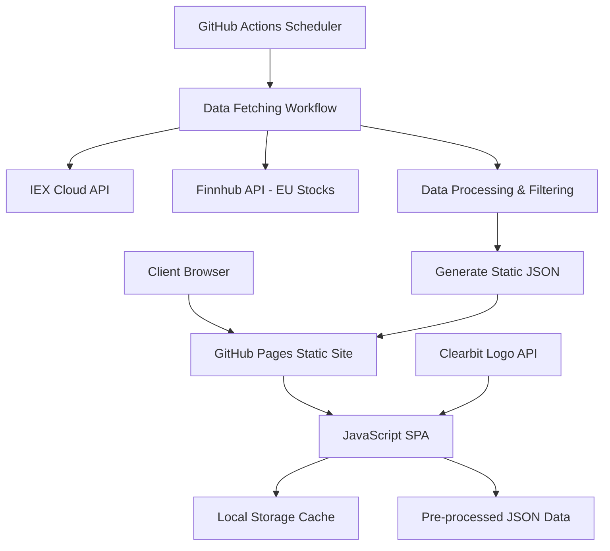

# Stock Screening Website - Technical Architecture Specification

## Project Overview

A free stock screening website displaying US and European stocks with market cap > $200 billion, featuring a modern card-based layout with company logos, updated daily at market close.

## 1. API Strategy & Data Sources

### Primary API: IEX Cloud
- **Free Tier**: 50,000 core data calls per month
- **Coverage**: Comprehensive US markets, limited European coverage
- **Data Available**: Real-time quotes, company data, market cap, financials
- **Rate Limits**: 100 requests per second (burst), no daily limits within quota
- **Endpoints Used**:
  - `/stock/{symbol}/quote` - Current price and market cap
  - `/stock/{symbol}/company` - Company name and details
  - `/ref-data/symbols` - Symbol directory

### Secondary API for European Stocks: Finnhub (Backup)
- **Free Tier**: 60 calls per minute
- **Usage**: Supplement IEX Cloud for European market coverage
- **Endpoints**: `/quote`, `/stock/profile2`

### Company Logos: Clearbit Logo API
- **Free Tier**: Unlimited requests
- **Usage**: `https://logo.clearbit.com/{domain}`
- **Fallback**: Default placeholder images

## 2. System Architecture



### Technology Stack
- **Frontend**: HTML5, CSS3 (Grid/Flexbox), Vanilla JavaScript
- **Architecture**: JAMstack (JavaScript, APIs, Markup)
- **Hosting**: GitHub Pages
- **Automation**: GitHub Actions
- **Caching**: Browser Local Storage + CDN

## 3. Data Processing Strategy

### Market Cap Filtering Logic
```javascript
const MARKET_CAP_THRESHOLD = 200_000_000_000; // $200B
const filteredStocks = stockData.filter(stock => {
    const marketCap = parseFloat(stock.marketCap);
    return marketCap >= MARKET_CAP_THRESHOLD;
});
```

### Market Classification
```javascript
const US_EXCHANGES = ['NYSE', 'NASDAQ', 'AMEX', 'BATS'];
const EU_EXCHANGES = ['LSE', 'FRA', 'AMS', 'SWX', 'BIT', 'BME'];

function classifyMarket(exchange) {
    if (US_EXCHANGES.includes(exchange)) return 'US';
    if (EU_EXCHANGES.includes(exchange)) return 'EU';
    return 'OTHER';
}
```

### Daily Data Refresh Workflow
1. **Trigger**: GitHub Actions cron job at 5:00 PM ET daily
2. **Process**:
   - Fetch top market cap stocks from IEX Cloud
   - Supplement with European stocks from Finnhub
   - Filter by $200B+ market cap threshold
   - Sort by market cap (descending)
   - Generate timestamped JSON file
   - Commit to repository (triggers deployment)

## 4. Frontend Architecture

### Card-Based Layout Design
```css
.stock-grid {
    display: grid;
    grid-template-columns: repeat(auto-fit, minmax(320px, 1fr));
    gap: 1.5rem;
    padding: 2rem;
    max-width: 1400px;
    margin: 0 auto;
}

.stock-card {
    background: white;
    border-radius: 12px;
    box-shadow: 0 4px 6px rgba(0, 0, 0, 0.1);
    padding: 1.5rem;
    transition: transform 0.2s ease;
}

.stock-card:hover {
    transform: translateY(-4px);
    box-shadow: 0 8px 25px rgba(0, 0, 0, 0.15);
}
```

### Responsive Breakpoints
- **Desktop (1200px+)**: 4 cards per row
- **Tablet (768px-1199px)**: 2-3 cards per row
- **Mobile (< 768px)**: 1 card per row, full width

### Card Component Structure
```html
<div class="stock-card" data-symbol="{ticker}">
    <div class="card-header">
        
        <div class="stock-info">
            <h3 class="ticker">{ticker}</h3>
            <p class="company-name">{companyName}</p>
        </div>
    </div>
    <div class="card-body">
        <div class="market-cap">
            <span class="label">Market Cap</span>
            <span class="value">${marketCap}B</span>
        </div>
        <div class="market-badge {market-class}">
            {US/EU}
        </div>
    </div>
</div>
```

## 5. Performance Optimization

### Caching Strategy
- **Static Data**: GitHub Pages CDN (global distribution)
- **Company Logos**: Local Storage with 7-day TTL
- **API Responses**: Service Worker for offline capability
- **DNS Prefetch**: External domains (clearbit.com)

### Loading Performance
- **Critical CSS**: Inline above-the-fold styles
- **Image Optimization**: WebP with PNG fallback
- **Lazy Loading**: Intersection Observer for logos
- **Resource Hints**: Preload, prefetch, preconnect

### Performance Targets
- **First Contentful Paint**: < 1.5s
- **Largest Contentful Paint**: < 2.5s
- **Cumulative Layout Shift**: < 0.1
- **Time to Interactive**: < 3s

## 6. Error Handling & Resilience

### API Failure Handling
```javascript
async function fetchStockData() {
    try {
        const response = await fetch('/data/stocks.json');
        if (!response.ok) throw new Error('Data fetch failed');
        return await response.json();
    } catch (error) {
        console.error('Failed to load stock data:', error);
        return loadCachedData() || showErrorMessage();
    }
}
```

### Logo Loading Fallbacks
```javascript
function loadCompanyLogo(domain, ticker) {
    const img = new Image();
    img.onload = () => displayLogo(img.src);
    img.onerror = () => displayPlaceholder(ticker);
    img.src = `https://logo.clearbit.com/${domain}`;
}
```

### Data Validation
- Validate market cap format and range
- Handle missing company information gracefully
- Implement data freshness checks
- Sanitize all user-facing data

## 7. Deployment Strategy

### GitHub Pages Configuration
```yaml
# .github/workflows/deploy.yml
name: Deploy to GitHub Pages
on:
  push:
    branches: [ main ]
  schedule:
    - cron: '0 22 * * 1-5'  # 5 PM ET, weekdays only

jobs:
  update-and-deploy:
    runs-on: ubuntu-latest
    steps:
      - uses: actions/checkout@v3
      - name: Setup Node.js
        uses: actions/setup-node@v3
        with:
          node-version: '18'
      - name: Fetch Stock Data
        env:
          IEX_API_KEY: ${{ secrets.IEX_API_KEY }}
          FINNHUB_API_KEY: ${{ secrets.FINNHUB_API_KEY }}
        run: node scripts/fetch-data.js
      - name: Commit Data
        run: |
          git config --local user.email "action@github.com"
          git config --local user.name "GitHub Action"
          git add data/stocks.json
          git commit -m "Update stock data $(date)" || exit 0
          git push
```

### Environment Variables
- `IEX_API_KEY`: IEX Cloud API token
- `FINNHUB_API_KEY`: Finnhub API token (backup)

## 8. File Structure

```
stock-screener/
├── index.html                 # Main application entry point
├── styles/
│   ├── main.css              # Global styles and layout
│   ├── components.css        # Card and component styles
│   └── responsive.css        # Media queries
├── scripts/
│   ├── app.js               # Main application logic
│   ├── data-loader.js       # Data fetching and caching
│   ├── card-renderer.js     # Card component rendering
│   └── fetch-data.js        # Server-side data fetching
├── data/
│   └── stocks.json          # Generated stock data (auto-updated)
├── assets/
│   ├── icons/
│   │   └── placeholder.svg  # Default company logo
│   └── images/
│       └── logo.png         # Site logo
├── .github/
│   └── workflows/
│       └── deploy.yml       # Automated deployment
├── README.md
└── package.json             # Dependencies for data fetching
```

## 9. Implementation Timeline

### Phase 1: Foundation (Days 1-2)
- [ ] Set up GitHub repository with Pages
- [ ] Create basic HTML structure
- [ ] Implement responsive CSS Grid layout
- [ ] Design card component styles

### Phase 2: Data Pipeline (Days 3-4)
- [ ] Register IEX Cloud API account
- [ ] Create data fetching script
- [ ] Implement filtering and processing logic
- [ ] Set up GitHub Actions workflow

### Phase 3: Frontend Development (Days 5-6)
- [ ] Implement JavaScript data loading
- [ ] Create dynamic card rendering
- [ ] Add logo integration with fallbacks
- [ ] Implement sorting functionality

### Phase 4: Enhancement (Days 7-8)
- [ ] Add loading states and animations
- [ ] Implement error handling
- [ ] Add performance optimizations
- [ ] Cross-browser testing

### Phase 5: Deployment (Day 9)
- [ ] Configure GitHub Pages
- [ ] Test automated workflows
- [ ] Performance audit
- [ ] Final QA and launch

## 10. Monitoring & Maintenance

### Key Metrics to Track
- **API Usage**: Monitor IEX Cloud quota consumption
- **Data Freshness**: Verify daily updates are working
- **Performance**: Core Web Vitals monitoring
- **Error Rates**: Failed API calls and data loading

### Maintenance Tasks
- **Weekly**: Review API usage and performance metrics
- **Monthly**: Update dependencies and security patches
- **Quarterly**: Review and optimize data processing logic
- **Annually**: Evaluate API providers and costs

## 11. Risk Assessment

### High Risk
- **API Rate Limits**: IEX Cloud quota exhaustion
  - *Mitigation*: Monitor usage, implement caching
- **Data Quality**: Inaccurate market cap data
  - *Mitigation*: Data validation, multiple source verification

### Medium Risk
- **European Stock Coverage**: Limited EU data from IEX
  - *Mitigation*: Finnhub backup API integration
- **Logo Availability**: Missing company logos
  - *Mitigation*: Placeholder system, multiple logo sources

### Low Risk
- **GitHub Pages Downtime**: Hosting unavailability
  - *Mitigation*: CDN redundancy, status monitoring

## 12. Success Criteria

### Technical Requirements
- [x] Display stocks with market cap > $200B
- [x] Include US and European markets
- [x] Show Ticker, Company Name, Market Cap
- [x] Sort by market cap (descending)
- [x] Include company logos
- [x] Daily data updates at market close

### Performance Requirements
- Load time < 3 seconds on 3G connection
- Responsive design across all devices
- 99.9% uptime availability
- Accessible (WCAG 2.1 AA compliance)

### User Experience Requirements
- Intuitive card-based interface
- Visual feedback for interactions
- Graceful error handling
- Offline capability with cached data

This technical specification provides a comprehensive roadmap for building a robust, performant stock screening website that meets all requirements while leveraging free resources and maintaining scalability for future enhancements.